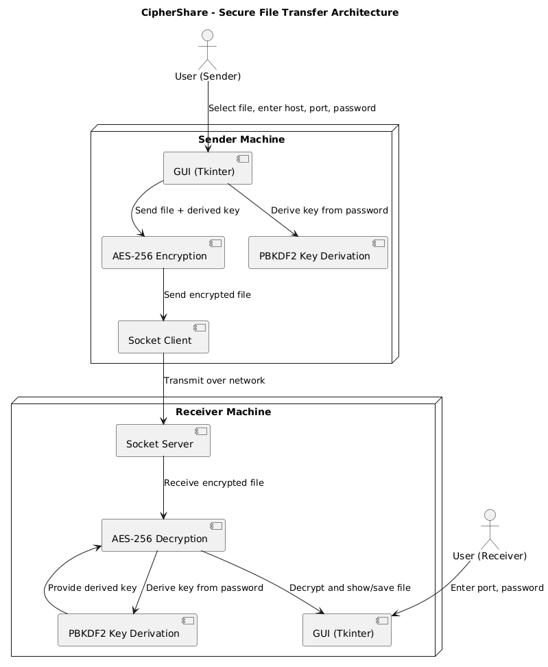

# CipherShare

A secure file transfer tool with end-to-end encryption, built with Python and Tkinter.

## Disclaimer

This project started as a personal necessity when I needed a secure way to transfer sensitive work documents between my home office and work laptop. While working from home, I often needed to share confidential files with myself across different devices, and I wasn't comfortable using cloud storage services for sensitive data. This led me to create CipherShare as a quick solution.

As it was initially meant for personal use, the code is in a monolithic structure and not very well-maintained. It lacks proper modularization and some best practices that would be expected in a production environment. However, it served its purpose well for my personal needs and later evolved into this course project.

The code is shared here primarily for educational purposes, to demonstrate practical implementation of cryptographic concepts and secure file transfer mechanisms. While it's functional, I wouldn't recommend using it in a production environment without significant refactoring and security auditing.

## Project Overview

CipherShare is a cross-platform secure file transfer application developed to ensure confidential file sharing across networks. The tool leverages advanced encryption mechanisms like AES-256 and PBKDF2 key derivation to offer robust security for file transfers.

### Significance in Information Security

Data security is a growing concern in today's interconnected digital world. File transfer mechanisms are often vulnerable to interception or tampering. CipherShare addresses this concern by implementing end-to-end encryption, ensuring that only intended recipients can access the data. This project is highly relevant to the cryptography and data protection domains in information security and could have a significant impact on industries handling sensitive data, such as finance, healthcare, and legal services.

## System Architecture



## Features

- 🔒 End-to-end encryption using AES-256-CBC
- 📁 Support for multiple file transfers
- 🎨 Modern, customizable UI with dark/light themes
- 📊 Real-time transfer progress and speed monitoring
- 🔍 File integrity verification
- 📝 Transfer history tracking
- ⚙️ Customizable settings

## Prerequisites

- Python 3.7 or higher
- pip (Python package manager)

## Installation

1. Clone the repository:
```bash
git clone https://github.com/yourusername/CipherShare.git
cd CipherShare
```

2. Create and activate a virtual environment:
```bash
python -m venv .venv
source .venv/bin/activate  # On Windows: .venv\Scripts\activate
```

3. Install required packages:
```bash
pip install -r requirements.txt
```

## Usage

1. Start the application:
```bash
python controller.py
```

2. Choose your transfer mode:
   - **Send Mode**: Transfer files to another computer
   - **Receive Mode**: Receive files from another computer

3. Configure the transfer:
   - Enter the password for encryption
   - In Send mode: Enter the receiver's host address
   - Set the port number (default: 9999)

4. For sending files:
   - Click the file selection area or use the file dialog
   - Select one or more files to transfer
   - Click "Send Files"

5. For receiving files:
   - Click "Receive Files"
   - Wait for the sender to initiate the transfer

## Security Features

- **AES-256-CBC Encryption**: All data is encrypted using AES-256 in CBC mode
- **Password-based Key Derivation**: Uses PBKDF2 with SHA-256 for key generation
- **File Integrity**: SHA-256 hashing for file verification
- **Secure Padding**: PKCS7 padding for AES block alignment

## Settings

Access settings through the ⚙️ button to configure:
- Theme (Dark/Light)
- Default host and port
- Compression level
- File verification
- Transfer history

## File Transfer Process

1. **Connection Setup**:
   - Sender initiates connection to receiver
   - Both parties establish encrypted channel

2. **Metadata Exchange**:
   - File names, sizes, and hashes are exchanged
   - Initialization vectors (IVs) are generated

3. **File Transfer**:
   - Files are encrypted and sent in chunks
   - Progress is tracked in real-time
   - Speed and ETA are calculated

4. **Verification**:
   - Files are decrypted on receiver side
   - Hashes are verified for integrity
   - Transfer is logged in history

## Error Handling

The application handles various error scenarios:
- Connection timeouts
- Invalid passwords
- File access errors
- Network interruptions
- Data corruption

## Project Scope

### Core Features (Implemented)
- Development of a file transfer tool that encrypts files locally using AES-256 before transmission
- Use of PBKDF2 with HMAC-SHA256 for secure password-based key derivation
- Graphical User Interface for usability across platforms (Windows, Linux, macOS)

### Future Enhancements
- Web-based file sharing integration
- Advanced user authentication or identity management features (like digital certificates or 2FA)
- Enterprise-level deployment (limited to personal or small team usage)

## Contributing

1. Fork the repository
2. Create a feature branch
3. Commit your changes
4. Push to the branch
5. Create a Pull Request

## License

This project is licensed under the MIT License - see the LICENSE file for details.


## Acknowledgments

- Cryptography library for encryption
- Tkinter for the GUI
- Python standard library for networking
